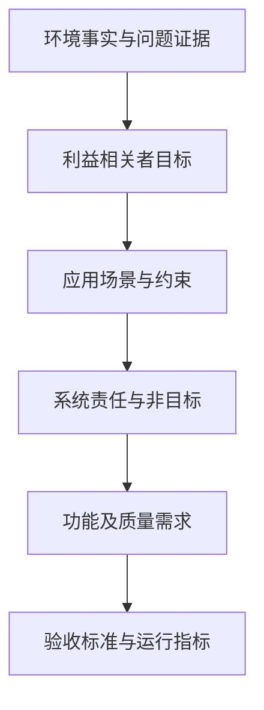
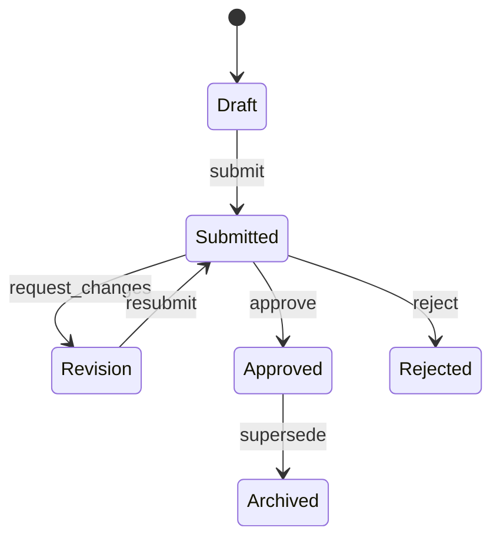
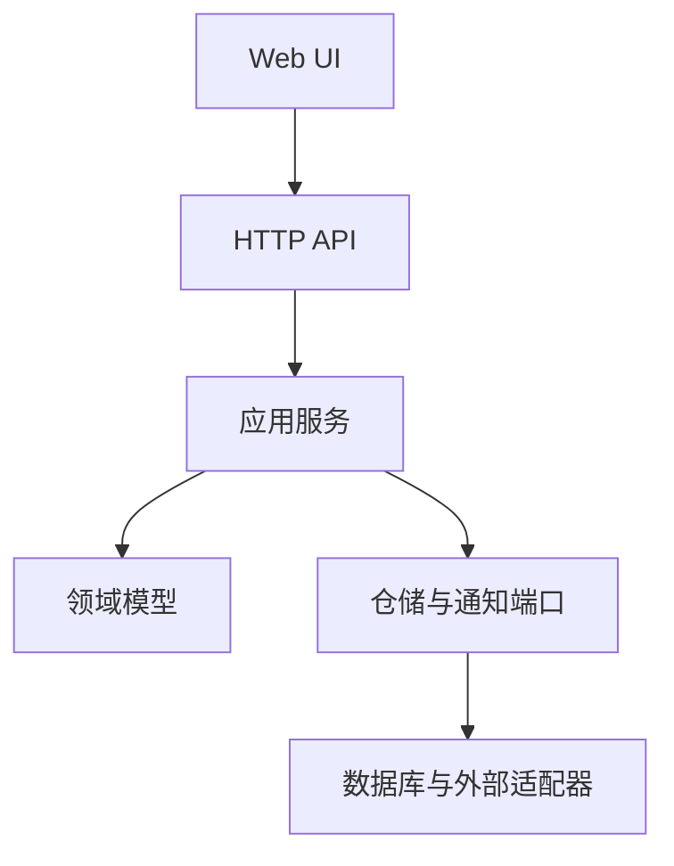
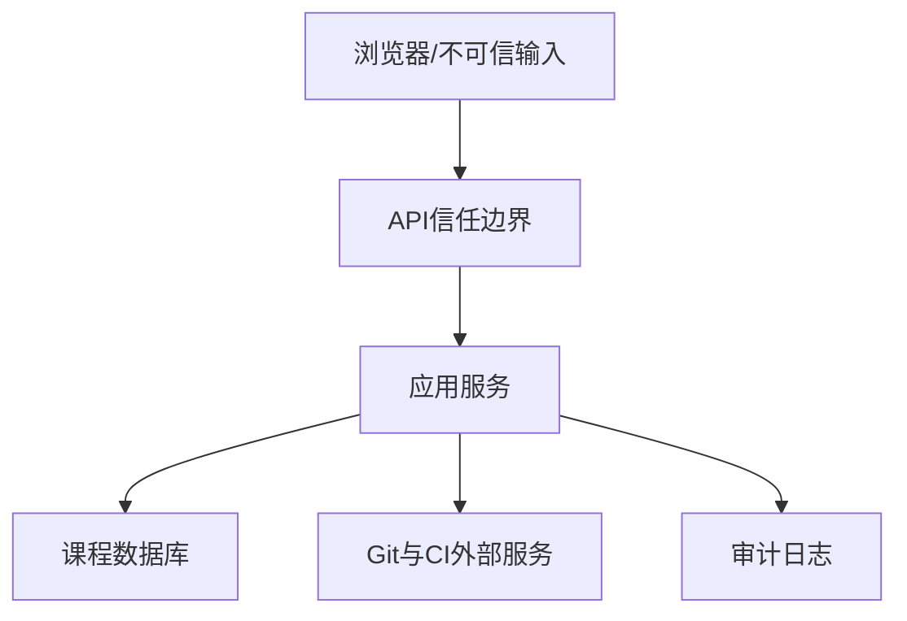
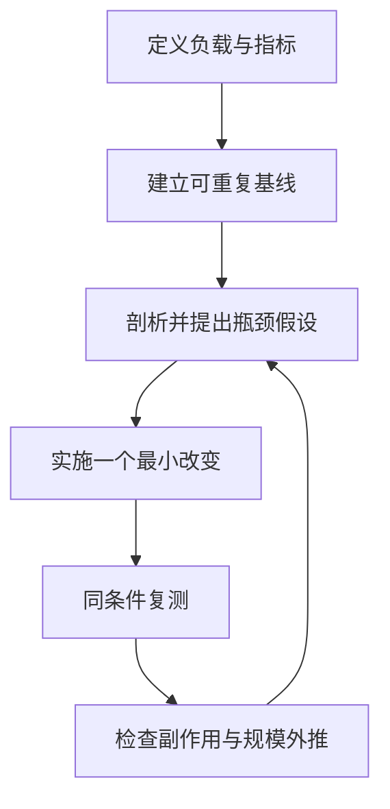
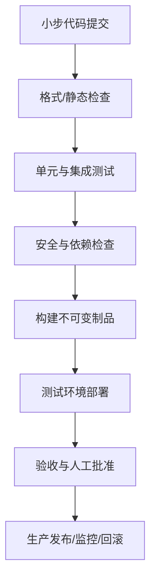

* content
{:toc}

# 主要特色和适用对象 {#features}

> 面向对象：计算机科学与技术、软件工程及相关专业的高年级本科和研究生、从事软件相关工作的职场人士和初创企业人员。  
> 建议学时：九讲，共15周、60学时；讲授、案例、实验、评审与项目推进相结合  
> 课程主线：现实问题 → 有效需求 → 业务与数据模型 → 架构与代码 → 验证与运行价值  
> 协作原则：AI Agent/Codex可以调查、生成候选方案和实施受控变更；人类负责目标、授权、取舍、独立验证和最终责任。

---

## 使用说明

本讲义与课程教学大纲和15周详细授课计划配套。九讲不是九组彼此独立的术语，而是对同一个软件工程闭环的逐层展开。每讲均回答六个问题：

1. 本讲解决什么现实问题？
2. 需要建立哪些模型或工程产物？
3. 如何把主张转化为可检查的证据？
4. 如何比较候选方案而不是直接接受第一个方案？
5. AI Agent/Codex可以做什么，人类必须保留什么责任？
6. 本讲产物如何成为下一讲的输入？

### 贯穿案例：课程项目证据与质量Gate平台

某研究生软件工程课程有30个三人小组。原有做法以代码仓库和期末演示为主，教师直到学期末才发现部分小组的问题定义不真实、需求不可验收、架构无法演化、测试只追求覆盖率，或演示数据经过人工挑选。拟建设一个平台，支持：

- 学生提交问题证据、需求、模型、架构决策、代码版本和实验结果；
- 教师按P0—P10质量Gate审查项目；
- 同伴在授权范围内开展盲审和复现；
- 系统保存需求—代码—测试—运行指标的追踪关系；
- AI Agent协助发现矛盾、生成候选测试和总结差异，但不得替教师作出最终评分或批准高风险操作。

课程不会把“建设一个智能教学平台”直接当作有效需求。首先要验证：教师和学生是否确有上述问题；平台是否比改进教学流程更合适；哪些结果可以证明它产生了价值。

### 通用证据链

| 层次 | 核心问题 | 典型产物 | 失败信号 |
|---|---|---|---|
| 问题证据 | 问题是否真实且值得解决？ | 访谈、观察、日志、基线数据 | 只有主观愿望，没有来源 |
| 方案证据 | 为什么选择当前方案？ | 候选方案、约束、ADR、风险探针 | 直接把熟悉技术当需求 |
| 实现证据 | 系统是否按规格工作？ | 代码、契约、测试、静态分析 | 只有演示，没有独立判定 |
| 运行证据 | 是否改善了现实结果？ | 时延、错误率、任务完成率、成本 | 指标与用户价值脱节 |
| 演化证据 | 变化后能否保持质量？ | 回归测试、迁移方案、监控、复盘 | 每次修改都依赖人工救火 |

### 人—Agent—Codex任务契约

向Codex下达任务时，至少说明：

```text
目标：要改变什么可观察行为？
上下文：相关用户、场景、仓库路径、入口和约束是什么？
范围：允许修改哪些文件或组件？明确不做什么。
验收：哪些测试、样本、指标或人工审查必须通过？
安全：是否允许联网、访问凭据、迁移数据或执行部署？
交付：需要代码差异、说明、测试结果、风险和回滚方法。
停止条件：遇到需求冲突、权限不足或破坏性操作时停止并报告。
```

Agent输出是候选成果而不是事实。学生必须能解释关键代码、复现实验，并记录采纳或拒绝Agent建议的理由。

---

# 第一讲 软件需求 {#lecture-1}

## 1.1 本讲问题

软件需求解决的是“为什么做、为谁做、在什么条件下做成什么样”的问题。需求错误通常不会被高质量代码自动修复；系统可能完全按设计运行，却解决了错误的问题。

本讲重点回答：

- 什么是有效需求，如何区别愿望、环境事实、业务目标、系统需求和设计方案？
- 如何通过场景、用例、用户故事、规格与验收标准表达需求？
- 如何使需求可追踪、可验证，并在代码变化后保持一致？

## 1.2 有效需求的判断标准

有效需求至少具备六个属性：

| 属性 | 判断问题 | 反例 |
|---|---|---|
| 有来源 | 谁提出？基于什么事实或规则？ | “大家都需要这个功能” |
| 有边界 | 包含什么，不包含什么？ | “支持所有项目管理活动” |
| 无歧义 | 不同读者能否作出相近解释？ | “页面要足够快” |
| 可行 | 时间、数据、技术、法律与资源是否允许？ | 要求系统读取无权访问的数据 |
| 可验收 | 如何判断完成或失败？ | “体验良好”但没有任务和指标 |
| 可追踪 | 能否关联设计、代码、测试和运行指标？ | 功能已实现却不知道对应哪个目标 |

“系统应在典型负载下快速返回结果”不是合格规格。可改写为：

> 在100个并发用户、每个项目不超过10,000条证据记录的测试环境中，查看项目证据页的服务器响应时间P95不超过800毫秒；若超时，应返回可识别错误并记录追踪ID。

这仍不是永恒真理，而是可被验证和修订的基线。

## 1.3 从现实问题到系统需求

推荐使用以下推导链：



案例推导：

| 层次 | 示例 |
|---|---|
| 环境事实 | 过去三届有38%的小组在期末才补写需求；教师无法确认需求是否早于代码形成 |
| 业务目标 | 在架构扩大前暴露不可验证需求，减少期末返工 |
| 场景 | 学生在P1提交需求，教师审查来源、边界和验收方法 |
| 系统责任 | 保存需求版本、来源、状态和审查意见；禁止无审查记录覆盖基线 |
| 非目标 | 系统不自动判断一个研究问题是否具有社会价值 |
| 功能需求 | 项目成员可创建需求版本；Gate审查者可批准、驳回或要求修订 |
| 质量需求 | 所有状态变化具有操作者、时间、旧值和新值的审计记录 |
| 价值指标 | P4后发生的重大需求返工比例较历史基线下降30% |

## 1.4 场景、用例、用户故事与规格

四种表达方式各有用途：

- **场景**描述具体情境和事件序列，适合发现环境约束与异常。
- **用例**描述参与者与系统的交互边界，适合梳理主要流程和替代流程。
- **用户故事**是协作提醒，不是完整规格，必须配合会话和验收标准。
- **需求规格**形成稳定、可追踪的约束，适合跨团队开发和正式验收。

示例用户故事：

> 作为Gate审查教师，我希望查看某条需求的来源、版本和对应测试，以便判断该需求是否具备进入架构设计的条件。

验收标准可用“给定—当—则”表达：

```gherkin
Scenario: 未关联验收方法的需求不能通过P1
  Given 一条状态为 submitted 的需求
  And 该需求没有关联测试、人工量规或运行指标
  When Gate审查者尝试批准该需求
  Then 系统拒绝批准
  And 返回错误代码 REQUIREMENT_EVIDENCE_MISSING
  And 写入一次失败的审计事件
```

## 1.5 需求与代码的一致性

一致性不是让文档和代码文字相同，而是建立可检查的追踪关系：

```text
目标 OBJ-01
  └──需求 REQ-017
       ├──架构决策 ADR-004
       ├──API契约 POST /requirements/{id}/approve
       ├──实现 approve_requirement()
       ├──测试 test_cannot_approve_without_evidence()
       └──运行指标 gate_rejection_total{reason="missing_evidence"}
```

可以用最小元数据表达追踪关系：

```python
from dataclasses import dataclass
from enum import Enum

class EvidenceKind(str, Enum):
    TEST = "test"
    RUBRIC = "rubric"
    METRIC = "metric"

@dataclass(frozen=True)
class Requirement:
    id: str
    statement: str
    source: str
    acceptance_refs: tuple[str, ...]
    evidence_kind: EvidenceKind

    def validate(self) -> None:
        if not self.source.strip():
            raise ValueError("requirement must have a source")
        if not self.acceptance_refs:
            raise ValueError("requirement must have acceptance evidence")
```

代码检查不能证明需求正确，但能防止已经约定的完整性条件被无意破坏。

## 1.6 AI Agent/Codex协作

适合交给Agent的任务：

- 从访谈记录中提取候选目标、约束、歧义和冲突；
- 将已有场景转换为候选验收标准；
- 检查需求是否缺少异常、权限、数据或失败处理；
- 根据需求ID生成追踪矩阵的初稿。

不得直接委托Agent决定：用户真正需要什么、证据是否可信、法律或伦理边界、最终优先级。Agent可能把频繁出现的词误当成重要需求，也可能补出访谈中不存在的事实。

建议任务：

```text
阅读 docs/interviews/ 和 docs/requirements.md。
只提取有原文证据的候选需求，每条给出来源文件和段落；
把推断单列为“待验证假设”，不得改写为事实。
检查歧义、冲突、遗漏的异常流程和不可测形容词。
不要修改代码。输出审查表和需要向用户追问的问题。
```

## 1.7 课堂实验

1. 将“建设一个智能教学平台”拆解为事实、目标、场景、系统责任和非目标。
2. 对三条模糊需求分别设计正常、边界、异常和滥用验收案例。
3. 交换小组材料，尝试给出两种互相冲突但都符合原文的实现；若能够做到，说明需求仍有歧义。
4. 用Codex生成审查意见，学生逐条标注“有证据、合理推断、无依据补充”。

## 1.8 Gate与课后练习

**Gate P1通过条件**：核心需求有来源、有边界、有验证方法，非目标明确；至少一个反例能够推翻当前错误解释。

课后提交：问题陈述、利益相关者、三个关键场景、需求清单、非目标、验收标准、追踪矩阵和AI使用记录。

思考题：

1. 为什么“用户提出的功能”不必然等于有效需求？
2. 覆盖全部用户故事是否足以证明软件有价值？
3. 需求频繁变化时，什么应保持稳定，什么可以延迟决定？

---

# 第二讲 业务建模 {#lecture-2}

## 2.1 本讲问题

业务建模把对现实活动的理解转化为角色、事件、规则、状态和信息结构。其目的不是画更多图，而是暴露隐含假设，使团队在编码前回答：系统中的对象代表什么、何时改变、由谁改变、哪些状态不允许出现。

## 2.2 为什么需要业务模型

自然语言中的同一个词可能指不同概念。例如“提交”可以指文件上传、形成不可变版本、进入审查队列或完成正式交付。如果没有模型，不同组件会分别实现自己的解释，最终造成状态冲突。

业务模型至少包含：

- **角色与责任**：学生、项目负责人、审查者、课程管理员；
- **活动与事件**：创建、提交、撤回、评审、批准、驳回；
- **规则与约束**：谁能做什么，什么前置条件必须成立；
- **状态与生命周期**：草稿、已提交、修订中、通过、归档；
- **异常与补偿**：重复提交、评审者冲突、截止后修订、数据恢复；
- **信息与证据**：需求、版本、证据、审查、审计事件。

## 2.3 从流程到领域模型

先记录业务事件，再识别长期存在的实体。以需求审查为例：



由此可识别：Project、Requirement、RequirementVersion、Evidence、GateReview、AuditEvent等实体。一个简化关系模型如下：

```sql
CREATE TABLE requirement (
    id TEXT PRIMARY KEY,
    project_id TEXT NOT NULL,
    current_version INTEGER NOT NULL,
    status TEXT NOT NULL CHECK (
        status IN ('draft','submitted','revision','approved','rejected','archived')
    )
);

CREATE TABLE requirement_version (
    requirement_id TEXT NOT NULL,
    version INTEGER NOT NULL,
    statement TEXT NOT NULL,
    source_ref TEXT NOT NULL,
    created_by TEXT NOT NULL,
    created_at TIMESTAMP NOT NULL,
    PRIMARY KEY (requirement_id, version),
    FOREIGN KEY (requirement_id) REFERENCES requirement(id)
);

CREATE TABLE acceptance_evidence (
    id TEXT PRIMARY KEY,
    requirement_id TEXT NOT NULL,
    kind TEXT NOT NULL CHECK (kind IN ('test','rubric','metric')),
    reference TEXT NOT NULL,
    FOREIGN KEY (requirement_id) REFERENCES requirement(id)
);
```

## 2.4 数据模型不等于数据库表

业务语义应先于存储实现。可以从四个维度描述数据：

1. **结构**：实体、属性、关系和基数；
2. **行为**：状态如何因命令或事件变化；
3. **约束**：任何时候都必须成立的不变量；
4. **质量与治理**：来源、准确性、时效、权限、保留和删除。

案例中的不变量：

- 已批准需求必须至少关联一种验收证据；
- 已提交版本不可原地修改，只能创建新版本；
- 审查者不能批准自己所属小组的Gate；
- 每次状态变化必须产生审计事件；
- 删除个人信息不能破坏必要的课程审计记录，应采用去标识或分离存储。

用领域方法封装规则比让控制器随意改字段更可靠：

```python
from dataclasses import dataclass, replace
from enum import Enum

class Status(str, Enum):
    DRAFT = "draft"
    SUBMITTED = "submitted"
    APPROVED = "approved"

@dataclass(frozen=True)
class RequirementAggregate:
    id: str
    status: Status
    evidence_count: int
    version: int

    def approve(self) -> "RequirementAggregate":
        if self.status is not Status.SUBMITTED:
            raise ValueError("only submitted requirements can be approved")
        if self.evidence_count < 1:
            raise ValueError("approval requires acceptance evidence")
        return replace(self, status=Status.APPROVED)
```

## 2.5 一致性、事务与事件

不是所有数据都需要同一种一致性。批准需求并写入审计日志属于一个不可分割的业务动作，通常要求事务一致性；向成员发送通知可以异步完成。

```python
def approve_requirement(repo, audit, requirement_id, reviewer_id):
    with repo.transaction() as tx:
        req = tx.requirements.get_for_update(requirement_id)
        approved = req.approve()
        tx.requirements.save(approved)
        tx.audit_events.append({
            "type": "RequirementApproved",
            "requirement_id": requirement_id,
            "reviewer_id": reviewer_id,
        })
    # 通知可由事件消费者异步处理
```

如果跨服务更新不能使用同一事务，应明确幂等、重试、补偿和最终一致性的边界，而不是假装分布式操作永不失败。

## 2.6 数据质量与合法性

对每个关键字段询问：谁产生、为何产生、是否可核验、多久失效、谁可访问、何时删除。尤其要避免把AI生成文本与人工确认事实混存而不标记来源。

建议为证据增加：`origin`、`collected_at`、`verified_by`、`verification_status`、`license`和`retention_until`。模型的字段越多不一定越好；字段应服务明确的业务决策或合规责任。

## 2.7 AI Agent/Codex协作

Agent可根据已确认的术语表生成候选ER图、迁移脚本和约束测试，但不能凭代码现状反推“正确业务”。遗留数据库往往只是历史决策的沉积。

给Codex的任务应要求：

- 先列出现有模型和迁移历史，不直接改表；
- 将每项建议关联到业务规则；
- 给出向前迁移、数据校验和回滚/补偿方案；
- 对数据丢失、锁表和不兼容变更停止并请求批准。

## 2.8 课堂实验与Gate

实验：从三个场景提取事件；建立领域词汇表；画状态机；写出五条不变量；将其中两条落实为数据库约束或领域测试；注入一次重复提交或并发批准错误。

**Gate P2通过条件**：模型能解释正常和异常场景；关键状态转换有前置条件；数据来源、权限和保留规则明确；至少一条业务不变量已被可执行验证。

思考题：

1. 为什么数据库外键不能替代完整的业务规则？
2. 什么情况下应保留历史版本，而不是更新当前记录？
3. 事件驱动是否必然提高可扩展性？它增加了哪些验证难度？

---

# 第三讲 软件架构 {#lecture-3}

## 3.1 本讲问题

软件架构是对系统责任、边界、依赖和关键决策的组织。合理架构不是组件越多越先进，而是在已知目标和约束下，使系统易于理解、验证、运行和演化。

## 3.2 从质量属性推导架构

功能告诉系统做什么，质量属性决定系统在压力和变化中如何表现。质量属性应写成场景：

| 属性 | 刺激与环境 | 可测响应 |
|---|---|---|
| 可修改性 | 增加一种Gate证据类型 | 一名开发者在1天内完成，已有类型无需修改 |
| 可用性 | 提交截止前服务实例故障 | 5分钟内恢复，已确认提交不丢失 |
| 安全性 | 学生尝试批准本组Gate | 请求被拒绝并写入审计日志 |
| 性能 | 100并发查看证据页 | P95响应不超过800ms |
| 可测试性 | 替换通知提供商 | 核心审批测试无需真实外部服务 |

架构选择是约束下的权衡。微服务可能支持独立部署，却增加网络失败、数据一致性、可观测性和团队协调成本。对一个学期项目，模块化单体往往是更可控的起点。

## 3.3 推荐的模块化单体



建议按业务能力组织仓库：

```text
src/
  projects/
  requirements/
    domain.py
    application.py
    api.py
    repository.py
  gates/
  evidence/
  identity/
tests/
  unit/
  integration/
  e2e/
docs/
  adr/
  requirements/
```

依赖规则是：外层可以依赖内层抽象，领域规则不依赖Web框架、数据库驱动或云平台。框架负责连接和生命周期，不能成为业务模型本身。

## 3.4 应用框架的收益与代价

框架提供路由、依赖注入、序列化、认证扩展和约定，减少重复基础设施代码；同时引入控制反转、升级风险和隐式行为。学习框架应回答：

- 程序入口和请求生命周期在哪里？
- 框架何时创建对象、开启事务、捕获异常？
- 哪些扩展点稳定，哪些属于内部实现？
- 如何在不启动整个框架时测试核心规则？

FastAPI示例中，路由只做协议转换，业务规则进入应用服务：

```python
from fastapi import APIRouter, Depends, HTTPException

router = APIRouter()

@router.post("/requirements/{requirement_id}/approve")
def approve(requirement_id: str, service=Depends(get_requirement_service)):
    try:
        return service.approve(requirement_id)
    except MissingEvidence as exc:
        raise HTTPException(status_code=409, detail={
            "code": "REQUIREMENT_EVIDENCE_MISSING",
            "message": str(exc),
        }) from exc
```

## 3.5 架构决策记录与风险探针

ADR应简洁记录：问题背景、决策驱动因素、候选方案、决定、后果和复审条件。

```markdown
# ADR-004：采用模块化单体
状态：Accepted
背景：3人团队、15周交付；领域边界仍在学习；需统一事务审计。
候选：分层单体、模块化单体、微服务。
决定：模块化单体，按业务能力分包并用依赖测试保护边界。
后果：部署简单；模块不能独立扩缩容；未来只有在监控证据支持时拆分。
复审条件：单模块负载或发布节奏连续两个版本成为主要瓶颈。
```

对未知技术先做风险探针，而不是建立完整系统。例如用一天验证“是否能在事务提交后可靠发布审计事件”，输出最小代码、失败条件和测量结果。

## 3.6 可演化性的工程机制

- 稳定领域概念，隔离易变技术细节；
- 使用明确接口和契约测试控制模块关系；
- 小步发布，用可观测数据验证架构假设；
- 记录重大决策及复审条件，避免架构成为不可质疑的历史；
- 用自动化架构测试防止依赖逆转。

```python
def test_domain_does_not_import_framework():
    forbidden = {"fastapi", "sqlalchemy", "requests"}
    imports = collect_imports("src/requirements/domain.py")
    assert imports.isdisjoint(forbidden)
```

## 3.7 AI Agent/Codex协作

仓库调查应先于修改。要求Codex列出入口、模块、依赖、测试命令和一条关键调用链，并以文件路径支持结论。随后让它提出两个以上方案和最小风险探针。避免“重构整个架构”“改成微服务”等开放指令。

**人类责任**：确定质量属性优先级，判断组织能力和运维成本，批准跨模块或不可逆变更，验证架构图与实际代码一致。

## 3.8 课堂实验与Gate

实验：运行参考仓库；追踪一个请求到数据库的调用链；绘制当前架构；写两份候选ADR；实现一个技术风险探针；用依赖测试验证模块边界。

**Gate P3通过条件**：架构由质量属性和约束推导；至少比较两个候选方案；关键风险经过小实验；任务可拆成可独立验证的垂直切片。

思考题：

1. 什么证据能够支持从模块化单体迁移到微服务？
2. “易扩展”为什么不是一个充分的架构目标？
3. 架构图与代码不一致时，哪一个才是事实？应如何修复？

---

# 第四讲 设计模式 {#lecture-4}

## 4.1 本讲问题

设计模式是对反复出现的设计问题、约束和权衡的命名，不是必须套用的模板。重构是在保持外部可观察行为不变的条件下改善内部结构。两者的共同目标是管理变化，而不是增加抽象层数。

## 4.2 从变化方向选择模式

先问“什么经常变化，什么必须稳定”：

| 变化问题 | 候选模式 | 代价 |
|---|---|---|
| 验收证据有测试、量规、指标等算法 | Strategy | 增加接口和对象数量 |
| 外部通知供应商变化 | Adapter | 需要维护映射与错误语义 |
| Gate状态变化触发多种后续动作 | Domain Event/Observer | 事件顺序和失败处理更复杂 |
| 对象构造涉及权限与默认规则 | Factory | 可能隐藏简单构造过程 |
| 审批流程按状态改变行为 | State | 状态类过多时阅读成本增加 |

以证据验证为例：

```python
from typing import Protocol

class EvidenceVerifier(Protocol):
    def verify(self, reference: str) -> bool: ...

class TestEvidenceVerifier:
    def verify(self, reference: str) -> bool:
        return test_registry.exists_and_passes(reference)

class RubricEvidenceVerifier:
    def verify(self, reference: str) -> bool:
        return rubric_store.has_completed_review(reference)

class ApprovalService:
    def __init__(self, verifiers: dict[str, EvidenceVerifier]):
        self.verifiers = verifiers

    def evidence_is_valid(self, kind: str, reference: str) -> bool:
        return self.verifiers[kind].verify(reference)
```

如果系统永远只有一种证据，Strategy可能是过度设计。模式是否合理取决于变化证据，而不是教材地位。

## 4.3 代码坏味道与根因

坏味道是调查线索，不是自动判决：

- 重复代码可能表示缺少共同概念，也可能只是偶然相似；
- 长函数可能混合多种责任，也可能是清晰的顺序算法；
- 大量条件分支可能需要多态，也可能适合一张决策表；
- 全局状态使测试相互影响；
- 过度封装使简单数据流难以追踪。

重构前必须建立行为基线。对缺乏测试的遗留代码，先写**特征测试**记录当前行为，再决定哪些行为是缺陷。

## 4.4 小步重构方法

建议循环：选择一个坏味道 → 建立测试 → 做一个小变换 → 运行测试 → 检查差异 → 提交可回滚版本。

重构前：

```python
def approve(req, user, db, mailer):
    if req.status != "submitted":
        return {"ok": False, "error": "bad status"}
    if len(req.evidence) == 0:
        return {"ok": False, "error": "missing evidence"}
    if user.group_id == req.group_id:
        return {"ok": False, "error": "conflict"}
    req.status = "approved"
    db.save(req)
    db.audit("approved", req.id, user.id)
    mailer.send(req.owner, "approved")
    return {"ok": True}
```

重构后可分离领域判断、事务和通知，但每一步都应保持既有API行为或明确版本变化。评价指标可以包括：圈复杂度、重复率、测试运行时间、修改相似功能所需文件数，以及评审者理解时间。单一指标不能证明设计更好。

## 4.5 重构与功能修改的边界

一个提交同时改变业务行为和大规模结构，会使失败难以定位。优先顺序通常是：

1. 用测试固定当前有价值行为；
2. 进行不改变行为的结构重构；
3. 提交并审查；
4. 添加新行为及其测试；
5. 比较前后指标和风险。

如果发现当前行为本身错误，应把“修复缺陷”与“结构重构”分别记录，不能用“重构”掩盖规格变化。

## 4.6 AI Agent/Codex协作

Codex擅长机械性重命名、提取函数、补充测试候选和小范围接口迁移；但它容易进行范围膨胀、创造未要求的抽象，或在测试不足时误改行为。

任务示例：

```text
目标：降低 src/gates/service.py 中 approve() 的职责混合。
范围：只修改 gates 模块及对应测试；不改变HTTP契约和数据库结构。
步骤：先添加覆盖当前正常、缺证据、利益冲突三种行为的特征测试；
再提出两种最小重构方案，待选择后实施其中一种。
验收：全部原测试通过；新增测试通过；公开API无变化；给出diff摘要和回滚点。
停止：如果现有测试与需求REQ-017冲突，停止并报告。
```

## 4.7 课堂实验与Gate

实验：识别一个坏味道；写特征测试；实施三次小重构并分别提交；比较模式方案与简单条件方案；让另一组在限定时间内解释修改后的代码。

通过条件：问题和变化方向明确；模式有替代方案；重构有回归保护；差异小且可回滚；能够用证据说明维护性是否改善。

思考题：

1. 为什么模式使用数量不能衡量设计水平？
2. 如何证明一次重构没有改变行为？测试能否给出完全证明？
3. 什么情况下适度重复比过早抽象更好？

---

# 第五讲 接口设计 {#lecture-5}

## 5.1 本讲问题

接口是两个责任主体之间的承诺，包括用户与系统、前端与后端、模块与模块以及系统与外部服务。良好接口使调用者能够预测结果、处理失败并适应版本变化。用户界面则帮助用户形成正确的系统模型并完成目标，而不是装饰后端数据。

## 5.2 API契约

一个完整API契约应说明：资源与动作、输入、输出、错误、权限、状态、幂等、并发、分页、版本和可观测性。

```yaml
paths:
  /requirements/{id}/approval:
    post:
      operationId: approveRequirement
      responses:
        "200":
          description: Approval recorded
        "403":
          description: Reviewer has no permission or has a conflict
        "409":
          description: State conflict or acceptance evidence missing
        "404":
          description: Requirement not found
```

错误响应必须对程序和用户都有意义：

```json
{
  "error": {
    "code": "REQUIREMENT_EVIDENCE_MISSING",
    "message": "批准前至少关联一种验收证据",
    "trace_id": "01J...",
    "details": {"requirement_id": "REQ-017"}
  }
}
```

不要把内部堆栈、SQL或密钥返回给客户端。

## 5.3 幂等、并发和版本

提交、支付、审批等动作可能因网络重试执行多次。可用幂等键和唯一约束保护：

```python
@router.post("/requirements/{req_id}/approval")
def approve(req_id: str, idempotency_key: str = Header(...)):
    previous = operation_store.find(idempotency_key)
    if previous:
        return previous.response
    response = service.approve(req_id)
    operation_store.save_once(idempotency_key, response)
    return response
```

并发更新可用版本号进行乐观锁；兼容性优先采用增加字段、双读写、迁移调用方、最后删除旧字段的渐进步骤。API版本不是逃避兼容设计的理由。

## 5.4 用户界面与交互模型

界面首先支持用户任务：审查者需要快速理解“为什么不能通过”，而不是只看到红色错误。可用性可以测量：

- 任务完成率；
- 完成时间与操作步数；
- 严重错误率和恢复率；
- 首次使用是否需要额外指导；
- 无障碍键盘操作、标签与颜色对比；
- 用户对结果和系统状态的理解是否正确。

表单应在前端提供即时反馈，但后端仍必须执行同样或更强的验证，因为客户端不可信。

```html
<form id="approval-form">
  <label for="comment">审查意见</label>
  <textarea id="comment" required minlength="20"></textarea>
  <button type="submit">确认批准</button>
  <p id="status" role="status" aria-live="polite"></p>
</form>
```

```javascript
document.querySelector('#approval-form').addEventListener('submit', async (e) => {
  e.preventDefault();
  const status = document.querySelector('#status');
  status.textContent = '正在提交…';
  const response = await fetch('/api/requirements/REQ-017/approval', {
    method: 'POST',
    headers: {'Content-Type': 'application/json'},
    body: JSON.stringify({comment: document.querySelector('#comment').value})
  });
  const body = await response.json();
  status.textContent = response.ok ? '已批准' : body.error.message;
});
```

## 5.5 前端编程模型

前端程序主要管理四类状态：服务器状态、用户输入状态、界面状态和URL/导航状态。错误地复制同一状态会造成显示与事实不一致。应明确单一事实来源、加载/空/错误/成功状态及取消过期请求。

语言与工具不是重点本身。HTML表达语义结构，CSS表达呈现约束，JavaScript/TypeScript表达交互与状态。框架可以帮助组件化和状态更新，但不能替代任务分析、无障碍语义和接口契约。

## 5.6 契约测试

```python
def test_approve_without_evidence_returns_stable_error(client, submitted_req):
    response = client.post(
        f"/requirements/{submitted_req.id}/approval",
        headers={"Idempotency-Key": "case-001"},
    )
    assert response.status_code == 409
    assert response.json()["error"]["code"] == "REQUIREMENT_EVIDENCE_MISSING"
    assert "trace_id" in response.json()["error"]
```

契约测试保护调用方依赖的行为，而不应绑定内部实现细节。

## 5.7 AI Agent/Codex协作

Agent可从OpenAPI生成客户端、类型和候选测试，检查错误响应不一致，并在既有设计系统下生成组件初稿。人类必须验证用户任务、可用性、无障碍、权限和错误语义。让Agent“设计一个现代化界面”通常只会得到视觉风格，而非可验证的任务支持。

## 5.8 课堂实验与Gate

实验：设计批准接口；构造重复请求和并发更新；实现加载/错误/成功三种界面状态；由五名非本组学生完成规定任务并记录完成率、时间与错误；修订契约。

通过条件：接口错误可预测；权限和状态明确；关键操作具有幂等或冲突处理；界面经过真实任务走查；前后端验证不依赖单方。

---

# 第六讲 安全设计 {#lecture-6}

## 6.1 本讲问题

安全设计的目标不是保证“绝对安全”，而是在明确资产、攻击者、信任边界和可接受风险后，预防、发现、限制并恢复攻击造成的损害。安全必须从需求和架构开始，而不是上线前增加一次扫描。

## 6.2 资产、威胁与风险

案例资产包括：学生身份、未公开代码、成绩与评语、访问令牌、审计记录、部署权限和系统可用性。威胁主体既可能是外部攻击者，也可能是越权用户、被攻陷依赖或误操作的Agent。

风险可用简化方法排序：

\[
Risk = Likelihood \times Impact
\]

数值只是优先级辅助。低概率但不可逆的成绩篡改仍可能需要强控制。



对每条跨边界数据流检查伪造、篡改、抵赖、泄露、拒绝服务和权限提升。

## 6.3 认证与授权

认证回答“是谁”，授权回答“是否允许做此动作”。不能仅依赖界面隐藏按钮。授权应在服务端基于主体、资源、动作和环境判断：

```python
def can_approve(user, requirement) -> bool:
    return (
        user.has_role("gate_reviewer")
        and user.course_id == requirement.course_id
        and user.group_id != requirement.owner_group_id
        and requirement.status == "submitted"
    )
```

对高风险动作可采用双人复核、短期凭据、再认证和最小权限。管理员不应在日常操作中持有无限权限。

## 6.4 常见应用风险与防御

| 风险 | 错误做法 | 设计控制 |
|---|---|---|
| 注入 | 拼接SQL或命令 | 参数化查询、严格类型、命令白名单 |
| 越权 | 只检查是否登录 | 每个资源动作执行授权 |
| 敏感信息泄露 | 日志记录令牌和完整提交 | 数据分级、脱敏、最小日志 |
| 会话劫持 | 长期有效令牌 | 安全Cookie、短期令牌、撤销机制 |
| 依赖攻击 | 自动接受任意新版本 | 锁定版本、来源验证、漏洞审查 |
| 文件上传 | 按文件名信任类型 | 大小/类型验证、隔离存储、恶意扫描 |
| 拒绝服务 | 无限制查询和生成 | 配额、超时、分页、队列和降级 |

参数化查询示例：

```python
row = db.execute(
    "SELECT * FROM requirement WHERE id = :id",
    {"id": requirement_id},
).one_or_none()
```

## 6.5 AI Agent特有风险

当Agent能够读文件、调用Shell、访问网络或部署环境时，提示文本可能成为控制信号。来自网页、Issue、文档或代码注释的内容都应视为不可信数据，不能自动升级为指令。

安全边界：

- 默认只读调查，修改限定目录；
- 机密信息不进入提示、日志或测试样本；
- 联网、凭据、生产部署、数据删除和权限变更需显式授权；
- 将生成代码视为第三方贡献，执行测试、依赖和许可证检查；
- 保留任务、工具调用、差异、审批与结果的审计记录；
- 遇到冲突指令和不可逆操作停止。

## 6.6 密钥、日志与恢复

密钥不写入仓库；使用运行环境的秘密管理机制；定期轮换并能撤销。日志应包含主体、动作、资源、结果、时间和追踪ID，但不记录密码、令牌或不必要的个人数据。安全事件响应包含发现、遏制、清除、恢复和复盘。

备份只有经过恢复演练才成为证据。系统应明确恢复点目标RPO和恢复时间目标RTO。

## 6.7 安全测试

```python
def test_student_cannot_approve_own_group(client, student_token, own_req):
    response = client.post(
        f"/requirements/{own_req.id}/approval",
        headers={"Authorization": f"Bearer {student_token}"},
    )
    assert response.status_code == 403
    assert audit_log.contains(
        action="approve_requirement",
        result="denied",
        resource_id=own_req.id,
    )
```

还应测试对象级越权、批量接口、并发竞态、失败日志、依赖漏洞和滥用负载。

## 6.8 课堂实验与Gate

实验：画数据流与信任边界；列资产；识别五条威胁；实现一条授权规则；攻击一个故意脆弱接口；检查仓库秘密和依赖；为Agent设计权限矩阵与审批点。

**Gate P6通过条件**：高风险资产和攻击路径已识别；关键权限有自动测试；秘密和敏感数据受控；严重风险有整改责任人；不存在未披露的严重风险。

思考题：

1. 为什么“只有课程内部用户”不能证明系统安全？
2. 安全扫描通过为何不等于安全设计完成？
3. Agent能执行某个命令是否意味着它被授权执行？

---

# 第七讲 性能优化 {#lecture-7}

## 7.1 本讲问题

性能优化不是让代码“看起来更快”，而是在规定负载和资源约束下改善与用户价值相关的指标，并证明改进不是测量噪声，也没有破坏正确性、安全性和可维护性。

## 7.2 建立性能目标

性能规格包含：工作负载、数据规模、并发模型、环境、观察窗口和指标。平均值会掩盖尾部延迟，通常同时报告P50、P95、P99、吞吐量、错误率和资源使用。

Little定律可帮助检查负载关系：

\[
L = \lambda W
\]

其中，系统平均并发任务数\(L\)等于平均到达率\(\lambda\)乘以平均响应时间\(W\)。它不是容量规划的全部，但能发现不合理假设。

案例目标：100并发用户、10,000条证据/项目时，证据页P95小于800ms、错误率低于0.1%、应用实例CPU低于70%。

## 7.3 测量优先的优化循环



常见瓶颈：算法复杂度、N+1查询、缺少索引、序列化、网络往返、锁竞争、缓存命中率低、外部服务和资源限制。

## 7.4 示例：消除N+1查询

错误方案为每条需求单独查询证据：

```python
requirements = repo.list_by_project(project_id)
result = []
for req in requirements:
    evidence = evidence_repo.list_by_requirement(req.id)
    result.append((req, evidence))
```

可改为批量预加载：

```python
requirements = repo.list_by_project(project_id)
ids = [req.id for req in requirements]
evidence_by_req = evidence_repo.grouped_by_requirement_ids(ids)
result = [(req, evidence_by_req.get(req.id, [])) for req in requirements]
```

但只有在剖析显示数据库往返占主要时间时，这个改动才是有证据的优化。还需验证返回数据顺序、权限过滤和内存使用。

## 7.5 缓存的正确性成本

缓存可以降低延迟，却引入失效、一致性、穿透、雪崩和敏感数据隔离问题。使用缓存前明确：键、值、有效期、失效事件、允许陈旧程度和故障降级。

批准状态属于高敏感、低容忍陈旧数据，不宜只依赖长时间缓存。统计看板可接受短暂延迟，可以采用事件更新或短TTL。

## 7.6 基准与负载测试

```python
import time
import statistics

def benchmark(call, rounds=200):
    samples = []
    for _ in range(rounds):
        start = time.perf_counter()
        call()
        samples.append((time.perf_counter() - start) * 1000)
    samples.sort()
    return {
        "median_ms": statistics.median(samples),
        "p95_ms": samples[int(0.95 * len(samples)) - 1],
        "max_ms": max(samples),
    }
```

微基准不能替代端到端负载测试。测试应预热、固定数据、重复运行、报告环境和置信区间或波动范围，并用相同条件比较前后版本。

## 7.7 AI Agent/Codex协作

Agent可以阅读剖析报告、寻找重复查询、生成基准脚本和提出候选优化。但必须给它真实测量数据；禁止让它仅凭代码猜测并大规模优化。每次只实施一个主要变化，以便归因和回滚。

任务示例要求输出：基线、瓶颈证据、两个候选方案、预计收益与风险、最小补丁、同条件复测结果。不得牺牲授权过滤或事务语义换取速度。

## 7.8 课堂实验与Gate

实验：建立固定数据集；运行基线；用剖析器定位瓶颈；实施一次查询或算法优化；重复测量；使用错误测试确认语义未变；说明结果是否可扩展到10倍数据。

**Gate P7通过条件**：负载模型贴近场景；基线可复现；优化针对已测瓶颈；前后数据可比；正确性和安全回归通过；局限已报告。

思考题：

1. 为什么平均响应时间下降不一定改善用户体验？
2. 当缓存提高速度却偶尔展示旧成绩时，如何作出权衡？
3. 单机微基准结果为什么不能直接推导生产容量？

---

# 第八讲 持续集成与发布运营 {#lecture-8}

## 8.1 本讲问题

持续集成与交付把代码变更转化为可重复、可审查、可回退的发布过程。DevOps不是购买一组工具，而是开发、测试、安全、运维和业务共同对运行结果负责的反馈机制。

## 8.2 从提交到运行的流水线



流水线的每个Gate都应有失败条件、责任人和证据保存方式。自动化不是把错误更快送入生产，而是缩短从变化到可信反馈的时间。

## 8.3 CI配置示例

```yaml
name: quality-gates
on: [push, pull_request]

jobs:
  verify:
    runs-on: ubuntu-latest
    steps:
      - uses: actions/checkout@v4
      - uses: actions/setup-python@v5
        with:
          python-version: "3.12"
      - run: pip install -r requirements.txt
      - run: ruff check src tests
      - run: mypy src
      - run: pytest --cov=src --cov-report=xml
      - run: python scripts/check_requirement_traceability.py
      - run: python scripts/check_migrations.py
```

实际项目应固定依赖、限制第三方Action权限，并根据风险增加秘密扫描、软件物料清单和漏洞检查。覆盖率只作为诊断信号，不能成为唯一Gate。

## 8.4 构建、配置与环境

理想制品应一次构建、多环境部署，配置和秘密在运行时注入。容器示例：

```dockerfile
FROM python:3.12-slim AS runtime
WORKDIR /app
COPY requirements.txt .
RUN pip install --no-cache-dir -r requirements.txt
COPY src ./src
USER 10001
CMD ["uvicorn", "src.main:app", "--host", "0.0.0.0", "--port", "8080"]
```

还应包含健康检查、资源限制、非root用户、只读文件系统（如可行）和明确的数据库迁移步骤。

## 8.5 发布策略与回滚

候选策略包括滚动发布、蓝绿发布、金丝雀和功能开关。选择依据是风险、成本、状态迁移和监控能力。

回滚并不总是简单地部署旧版本。若数据库已发生不兼容迁移，需要向前修复或双版本兼容。推荐扩展—迁移—收缩：先增加兼容字段，迁移数据和调用方，确认无旧使用后再删除。

发布前定义：

- 成功指标和观察窗口；
- 自动停止/回滚阈值；
- 数据迁移与备份验证；
- 值班责任人和沟通渠道；
- 已知风险与用户影响。

## 8.6 可观测性与事件复盘

可观测性由日志、指标和追踪共同支持。优先观察用户旅程，例如提交成功率、Gate处理时长、权限拒绝率和证据页P95，而非只观察CPU。

服务等级指标SLI是测量，服务等级目标SLO是期望范围。例如：30天窗口内提交API成功率不低于99.9%。错误预算帮助团队在可靠性和发布速度间作出显式取舍。

复盘应描述时间线、影响、检测、响应、技术与组织促成因素、修复和预防措施，避免只寻找个人责任。

## 8.7 一键部署的真实含义

“一键部署”是把环境检查、构建、测试、迁移、发布、健康验证和回退编排为受控过程，不是取消风险判断。对课程项目可以使用云平台简化基础设施，但学生仍应解释：制品在哪里、配置如何注入、数据库如何迁移、失败如何检测和恢复、成本如何产生。

## 8.8 商业模式与运行价值

运营指标应连接价值主张。若平台目标是提前发现项目风险，就应测量Gate前后返工、审查周期和复现率，而不只看登录次数。技术架构也受收费模式、服务等级、支持成本、合规和客户隔离影响。

## 8.9 AI Agent/Codex协作

Agent可生成流水线初稿、分析失败日志、比较部署清单和编写运行手册。生产凭据、数据库迁移、权限修改和正式发布必须设置人工批准。Agent提出“修复CI”的补丁时，应先说明失败根因，不得通过删除测试或放宽Gate制造绿色结果。

## 8.10 课堂实验与Gate

实验：建立CI；故意注入测试失败和依赖错误；构建制品；部署测试环境；执行数据库兼容迁移；制造健康检查失败并回滚；编写一次事件复盘。

**Gate P8/P9通过条件**：流水线可重复；制品与配置分离；发布有监控和回退；外组可依据文档复现；Agent权限与人工批准点可审计。

思考题：

1. CI全部通过为何不能证明可以安全发布？
2. 自动回滚在什么情况下会扩大数据损害？
3. 如何防止团队通过降低测试质量来缩短流水线时间？

---

# 第九讲 软件验证与测试 {#lecture-9}

## 9.1 本讲问题

验证关注“是否按规格构建系统”，确认关注“是否构建了能解决目标问题的系统”。测试通过执行样本发现缺陷，通常不能证明所有输入都正确；形式化验证可在明确模型和假设下给出更强保证，但仍受规格正确性和模型边界限制。

本讲安排在九讲末尾用于综合前八讲，但测试工作从第一讲验收标准开始，不能等代码完成后才启动。

## 9.2 测试层次与责任

| 层次 | 验证对象 | 优点 | 局限 |
|---|---|---|---|
| 单元测试 | 领域规则、纯函数、局部类 | 快、定位清晰 | 不能发现真实集成问题 |
| 集成测试 | 数据库、队列、外部适配器 | 验证协议和配置 | 慢、环境管理复杂 |
| 契约测试 | 提供方与调用方约定 | 发现接口不兼容 | 不验证完整用户流程 |
| 端到端测试 | 关键用户旅程 | 接近实际使用 | 脆弱、定位困难、成本高 |
| 属性测试 | 对大量生成输入验证不变量 | 擅长发现边界反例 | 需要正确设计生成器与属性 |
| 安全/性能测试 | 非功能风险 | 验证压力和滥用场景 | 对环境和负载敏感 |
| 用户/运行验证 | 现实任务与价值 | 连接业务目标 | 受样本、偏差和外部因素影响 |

应采用少量关键端到端测试、足够的集成测试和大量快速领域测试，而不是机械追求固定比例。

## 9.3 测试设计

从需求和风险设计等价类、边界值、决策表、状态迁移和滥用案例。审批决策表：

| 状态已提交 | 有证据 | 无利益冲突 | 预期 |
|---|---|---|---|
| 否 | 任意 | 任意 | 拒绝：状态冲突 |
| 是 | 否 | 任意 | 拒绝：缺少证据 |
| 是 | 是 | 否 | 拒绝：利益冲突 |
| 是 | 是 | 是 | 批准并记录审计 |

pytest参数化示例：

```python
import pytest

@pytest.mark.parametrize(
    "status,evidence,conflict,expected",
    [
        ("draft", 1, False, "STATE_CONFLICT"),
        ("submitted", 0, False, "EVIDENCE_MISSING"),
        ("submitted", 1, True, "REVIEWER_CONFLICT"),
        ("submitted", 1, False, "APPROVED"),
    ],
)
def test_approval_decision(status, evidence, conflict, expected):
    assert decide_approval(status, evidence, conflict).code == expected
```

## 9.4 测试判定能力

测试执行了代码不等于能发现错误。高覆盖率测试可能没有有效断言。可以用变异测试评估：自动改变条件、删除语句或替换运算符；如果测试仍通过，说明判定能力不足。

冻结样本用于稳定比较版本，但要防止开发者过度拟合。可将数据分为开发集、冻结验收集和独立挑战集；冻结集版本、来源和修改权限应受控。

## 9.5 属性测试与不变量

```python
from hypothesis import given, strategies as st

@given(st.lists(st.text(min_size=1), min_size=1, unique=True))
def test_version_history_is_append_only(statements):
    history = RequirementHistory.create(statements[0])
    for statement in statements[1:]:
        old = tuple(history.versions)
        history = history.revise(statement)
        assert tuple(history.versions[:-1]) == old
        assert history.current.statement == statement
```

属性测试擅长发现未想到的输入，但属性本身可能写错，仍需需求和领域审查。

## 9.6 测试替身与真实环境

Mock适合隔离慢或不稳定边界，但过度Mock会让测试只验证调用细节。领域逻辑优先使用真实对象；数据库和消息协议应有真实集成测试；外部服务可同时使用适配器单元测试、契约测试和少量沙箱测试。

测试应独立、可重复、能清理数据，并报告随机种子、时区、版本和环境。偶发测试必须调查根因，不能简单无限重试。

## 9.7 AI系统的额外验证

若系统包含生成式AI，单一精确输出断言常不适用。应建立：

- 冻结样本与任务分类；
- 明确量规和多位独立评审者；
- 事实引用、越权、隐私和拒答安全Gate；
- 基线模型与候选版本的盲评；
- 失败案例簇和回归集；
- 成本、时延、稳定性和人工升级率；
- 真实用户任务与运行后果。

“能回答所有问题”不可测；“在200个冻结样本上，经两位专家盲评，关键事实准确率不低于95%，严重越权建议为0，并在分歧时升级人工复核”才具有可管理性。即便通过，也只能在给定样本、量规和条件下成立。

## 9.8 AI Agent/Codex协作

Codex可以从决策表生成测试初稿、补充边界与失败场景、定位失败调用链和最小化反例。风险包括复制实现逻辑到测试、生成永远通过的弱断言、修改测试迎合错误代码、泄露真实数据。

任务示例：

```text
根据REQ-017、状态机和审批决策表生成候选pytest测试。
先列出测试类别和每个测试要杀死的潜在错误，再写代码。
不得读取实现后照抄条件；不得修改生产代码；不得放宽现有断言。
至少包括边界、重复请求、并发、越权和审计失败。
运行测试并报告失败，区分规格冲突、测试缺陷和实现缺陷；不自行选择哪一方正确。
```

## 9.9 从测试结果到质量结论

质量结论必须限定范围：

> 版本v1.2在提交哈希、依赖版本和测试环境X下，通过128个单元测试、24个集成测试、6个关键端到端场景及冻结安全样本；变异得分82%。仍未验证超过500并发、第三方身份服务区域故障和长期数据迁移。

这样的表述比“系统测试充分、质量优秀”更科学，因为它同时报告证据和边界。

## 9.10 综合实验与最终Gate

实验：从REQ-017建立追踪链；设计决策表；实现单元、集成和端到端测试；运行覆盖率与变异测试；修复一个被发现的弱断言；让外组依据文档复现；形成质量报告。

**最终Gate**：核心需求都有独立判定依据；测试覆盖风险而不仅覆盖代码；关键结果可由他人复现；失败与未测边界公开；代码、文档、测试和部署版本一致。

思考题：

1. 测试通过能够证明什么，不能证明什么？
2. 测试与实现都由同一个Agent生成时会产生什么相关性风险？
3. 何时应增加形式化规格、模型检查或人工专家验证？

---

# 十、九讲之间的追踪与项目交付

## 10.1 讲次—产物—Gate对应表

| 讲次 | 核心产物 | 项目Gate |
|---|---|---|
| 第一讲 软件需求 | 问题证据、场景、需求、验收、追踪矩阵 | P0—P1 |
| 第二讲 业务建模 | 流程、领域模型、数据字典、状态机、不变量 | P2 |
| 第三讲 软件架构 | 质量属性场景、候选架构、ADR、风险探针 | P3—P4 |
| 第四讲 设计模式 | 特征测试、重构计划、最小差异、回滚点 | 项目迭代审查 |
| 第五讲 接口设计 | API契约、界面原型、可用性与契约测试 | 原型v0.1 |
| 第九讲 验证与测试（前置实践） | 测试策略、冻结集、CI质量Gate | P5 |
| 第六讲 安全设计 | 威胁模型、权限矩阵、安全测试 | P6 |
| 第七讲 性能优化 | 负载模型、基线、剖析、对照实验 | P7 |
| 第八讲 持续集成与运营 | 流水线、部署、监控、回滚、价值指标 | P8—P9 |
| 综合验收 | 代码、报告、证据包、复现说明、路线图 | P10 |

说明：教学顺序中第九讲用于综合总结，但自动测试从第一讲开始形成，并在第十周先于安全和性能Gate集中建设；这避免将测试误解为项目末期活动。

## 10.2 最终项目证据包

最终提交至少包括：

1. 问题证据、价值主张和非目标；
2. 需求、模型、ADR及其版本历史；
3. 可复现代码、依赖、配置模板和许可证；
4. 单元、集成、端到端、安全和性能证据；
5. CI/CD、部署、监控、回滚和事件响应说明；
6. 需求—设计—代码—测试—指标追踪矩阵；
7. 已知缺陷、未验证范围和下一版本路线图；
8. 个人贡献与AI Agent/Codex使用声明。

## 10.3 统一评价量规

| 维度 | 优秀表现 | 不充分表现 |
|---|---|---|
| 问题理解 | 有多源事实、边界和反例 | 只有功能愿望 |
| 设计推理 | 比较候选方案并记录权衡 | 直接采用熟悉技术 |
| 实现质量 | 小步、可读、可测试、可回滚 | 演示驱动的大提交 |
| 验证证据 | 方法匹配主张、结果可复现 | 只报覆盖率或成功截图 |
| 运行价值 | 指标连接用户任务与成本 | 只统计访问量 |
| AI协作 | 任务有边界，人工审查且可解释 | 把Agent输出当结论 |
| 反思迁移 | 能说明局限并用于陌生问题 | 只能复述当前项目 |

课程的最终目标不是让学生记住最多的工具，而是使其能够在陌生问题中建立简洁模型，按需恢复必要复杂性，并用独立证据持续纠正需求、设计、代码和运行决策。
